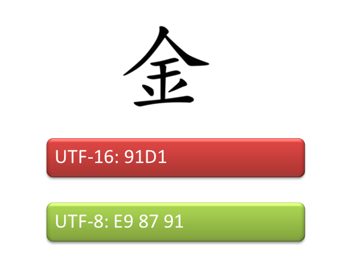

# Win32 C++ Code Converting Between Unicode UTF-16 and UTF-8 Using CStringW/A #

by Giovanni Dicanio

## Description ##

C++ code that wraps the Win32 APIs [**MultiByteToWideChar()**][1] and 
[**WideCharToMultiByte()**][2] in a convenient way, using ATL/MFC 
CString(A/W) classes.

This code can be used for **Unicode conversions** between UTF-16 and UTF-8.

ATL/MFC string classes are used, in particular:

- `CStringA` is used to store UTF-8 text
- `CStringW` is used to store UTF-16 (_"wide"_) text

The reusable code can be found in the **UnicodeConvAtl.h** 
and **UnicodeConvAtl.cpp** files.  

[1]: http://msdn.microsoft.com/en-us/library/windows/desktop/dd319072(v=vs.85).aspx
[2]: http://msdn.microsoft.com/en-us/library/windows/desktop/dd374130(v=vs.85).aspx

